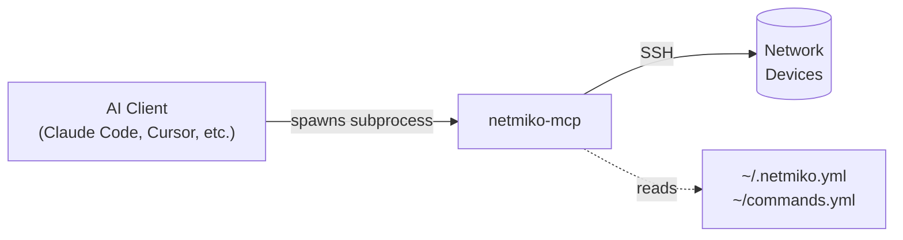
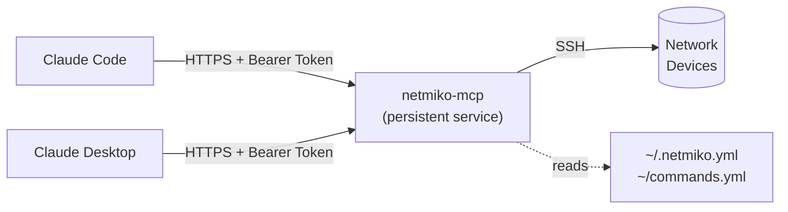

# Netmiko MCP Server

## Welcome to a New way to interact with your Network 

netmiko-mcp is a Model Context Protocol server that gives your AI client (Claude, Claude Code, Cursor, VS Code Copilot, and others) direct, controlled access to your network devices via SSH (and Telnet if absolutely necessary). Ask a question in plain English; the agent figures out which devices to query, runs the permitted commands, and returns results as a conversation, a formatted table, or structured JSON.  Whatever fits your workflow.

This repository is a great starting point for network engineers curious about what AI agents can actually do when given access to real devices. The setup process itself is AI-assisted: the `skills/` directory contains reference files that load directly into your AI client's context, so you can ask Claude to help you configure the server, set up inventory, or troubleshoot a connection.  It already has all the relevant details. See [Claude Code Skills](#claude-code-skills) for how to install them.

**Used carefully,** this is a powerful tool. Read the warnings below before connecting it to anything important.

## This repository is still a work-in-process. Do NOT use this repository at this time.
> **WARNING:** You can make serious, incredibly detrimental mistakes by using this tool. This tool could cause massive outages in your environment. You, and you alone, are solely responsible for using this tool. Don't say I didn't warn you.

> I have tried to make reasonable defaults and to limit what the Netmiko-MCP server allows (by default). It is highly advisable to start with ONLY show commands executed against ONLY test or lab devices. You should also strongly consider additional security mechanisms completely outside of the LLM and Netmiko- MCP (for example, a tightly-controlled AAA solution). LLMs and LLM-agents inherently have a lot of variance and are difficult to predict and control.
<br />

## Security Recommendations

The controls in Netmiko-MCP are a best-effort layer and should not be your only line of defense. You should strongly consider using AAA (e.g. TACACS+) with a dedicated read-only service account. AAA should independently authorize and audit what commands the account can execute on your devices. The MCP command authorization can potentially be bypassed, so this tool should only be used by authorized personnel. Untrusted input should not be used with this MCP.
<br />
<br />

## What Is MCP?

MCP (Model Context Protocol) is the standard that lets AI clients like Claude take actions beyond answering questions. Without it, you copy-paste `show version` output and ask for analysis. With netmiko-mcp registered as an MCP server, your AI client can connect to your network devices directly providing your AI client the means to discover your inventory, run commands, and return results.  All triggered by a plain-English prompt.

You define what commands are permitted. The server enforces that whitelist on every request before anything touches a device.

## How This Works

netmiko-mcp sits between your AI client and your network devices. It supports two transport modes:

### Option A — STDIO 

Your AI client launches netmiko-mcp as a local subprocess. No ports are opened and no persistent process is required. The server starts when you open a session in your AI client and stops when you close it.



Best for: a single user running everything on one machine.

### Option B — Streamable HTTP

The server runs as a persistent service and listens on a network port. Your AI client connects over HTTP with a bearer token. The server can run on a jump host, a VM, or any machine with SSH access to your devices — and multiple clients or users can share one instance.



Best for: shared team access, centralized audit logging, or when your AI client runs on a different machine than your network tooling.

## Prerequisites

- **uv**  Python package manager used to install and run the server. One-line install for macOS/Linux: `curl -LsSf https://astral.sh/uv/install.sh | sh`. Windows: `winget install astral-sh.uv`. Full instructions at [astral.sh/uv](https://astral.sh/uv).
- **An AI client**  [Claude Code](https://docs.anthropic.com/en/docs/claude-code) is recommended for getting started. It is a terminal CLI (`claude`) — not the same as the web chat at claude.ai or the Claude Desktop app. If you are already using Cursor, VS Code + Copilot, or another supported client, those work too.  See [Supported MCP Clients](#supported-mcp-clients-june-2026).

> **Claude Code vs Claude Desktop vs claude.ai:** Claude Code is a command-line tool you run in your terminal. Claude Desktop is a standalone GUI app. claude.ai is the browser-based chat interface. All three are different products that connect to the same Claude AI — but only Claude Code and Claude Desktop can run MCP servers in stdio mode. Claude Code is the easiest to get started with for MCP development and testing.

## Installation

Both install methods below support both transport modes (stdio and HTTP).

**Option 1 — uv tool (recommended for most users):**

```bash
uv tool install netmiko-mcp
```

Installs the `netmiko-mcp` command globally. Required when clients like Claude Desktop, Cursor, or Devin Desktop spawn the server as a subprocess (stdio mode) — those clients launch from their own working directory and cannot find a project-local virtual environment.

> **Note about uv tool install:**
> Unlike git clone, `uv tool install` does not create a project directory in the current folder. It installs into uv’s managed tools directory and exposes the executable on your PATH. To see where the executables land, run:
> `uv tool dir --bin`

**Option 2 — Clone from source:**

```bash
git clone https://github.com/ktbyers/netmiko_mcp
cd netmiko_mcp
uv sync
```

> **Note:** `uv sync` installs into the project's local virtual environment, which works for Claude Code but not for clients like Claude Desktop, Cursor, or Devin Desktop that launch the server from a different working directory. For those clients in stdio mode, use Option 1. For HTTP mode, `uv run netmiko-mcp` from the cloned directory works fine — `uv run` resolves the local venv automatically.


## Getting Started

Setup requires three things: an MCP configuration file, a device inventory, and a commands whitelist.

> **Simplest setup:** Place all three files in your home directory using the default names:  `~/.netmiko-mcp.yml`, `~/.netmiko.yml`, and `~/commands.yml`. The server finds them automatically with no environment variables or extra configuration required in any client.

If you need to use different locations, set the `NETMIKO_MCP_CONFIG` environment variable to point at your configuration file which can point to custom locations for your inventory and command YML files:

```bash
export NETMIKO_MCP_CONFIG="$HOME/.netmiko-mcp.yml"
```
<br />

### Step 1 - Create the Netmiko-MCP configuration file

Create `~/.netmiko-mcp.yml`:

```yaml
inventory_type: "netmiko_tools"
inventory_file: "~/.netmiko.yml"
command_file: "~/commands.yml"
```

Additional details on the Netmiko-MCP configuration file and corresponding environment variables: [docs/configuration.md](docs/configuration.md)
<br />
<br />

### Step 2 - Create the device inventory

Currently, device inventory is limited to Netmiko Tools' [device inventory](https://pynet.twb-tech.com/blog/netmiko-grep-command-line-utility.html#creating-the-inventory). It is likely this will be expanded in the future to support additional inventory sources.

Create `~/.netmiko.yml`. Each entry is a named device block whose fields map directly to Netmiko's connection parameters. Devices can be collected into named groups using a `groups` key.

```yaml
core01:
  device_type: cisco_ios
  host: 192.168.1.1
  username: admin
  password: yourpassword

access01:
  device_type: cisco_ios
  host: 192.168.1.2
  username: admin
  password: yourpassword

groups:
  switches:
    - core01
    - access01
```

The `device_type` field must match a Netmiko-supported platform (e.g. `cisco_ios`, `cisco_nxos`, `arista_eos`, `juniper_junos`). See the [Netmiko supported platforms list](https://github.com/ktbyers/netmiko/blob/develop/PLATFORMS.md) for the full set.

**A note on credentials:** Plaintext credentials are fine for lab or test environments. For anything beyond that, use the built-in Fernet encryption — the encrypted file is safe to store and the only secret to protect is your passphrase. See the [netmiko-tools-yml skill](skills/netmiko-tools-yml/SKILL.md) for the full encryption walkthrough.

Netmiko Tools AI [skill file](https://github.com/ktbyers/netmiko_mcp/blob/main/skills/netmiko-tools-yml/SKILL.md)
<br />
<br />

### Step 3 - Create the commands whitelist

Create `~/commands.yml` to define what the LLM is allowed to send to devices. By default
**no commands are permitted**:

```yaml
allowed_commands:
  - "show version"
  - "show ip interface brief"

denied_commands: []
```

The default location is `~/commands.yml`. To use a different path, set `command_file` in your `~/.netmiko-mcp.yml`:

```yaml
command_file: "~/network/commands.yml"
```

Or override it with an environment variable:

```bash
export NETMIKO_MCP_COMMAND_FILE="~/network/commands.yml"
```

Full details on allowed/denied matching, globbing, pipes, and unsafe characters: [docs/commands.md](docs/commands.md)
<br />
<br />

## Registering with Your AI Client

<<<<<<< HEAD
With the server installed and the three config files in place, register `netmiko-mcp` with your AI client. Each client has its own config file or CLI command for registering the server.  See the [mcp-client-config skill](skills/mcp-client-config/SKILL.md) for per-client instructions covering Claude Code, Claude Desktop, Cursor, Devin Desktop, VS Code + GitHub Copilot, and Kiro.


## Verifying the Connection

With the server registered, open a session with your AI client and send:
=======
With the server installed and the three config files in place, register `netmiko-mcp` with your AI client. Each client has its own config file or CLI command for registering the server - see the [mcp-client-config skill](skills/mcp-client-config/SKILL.md) for per-client instructions covering Claude Code, Claude Desktop, Cursor, Devin Desktop, VS Code + GitHub Copilot, and Kiro.
>>>>>>> upstream/main

> ping

The server should respond with `pong`. If that works, try:

> List all my devices

The agent will call `list_devices` and return the names of everything in your `~/.netmiko.yml` inventory. No credentials are ever returned. If both work, you are ready to start querying your devices.

## Supported MCP Clients (June 2026)

| Client | stdio | HTTP | Verified | Notes |
|---|---|---|---|---|
| Claude Code | ✓ | ✓ | ✓ | Recommended for development and testing |
| Claude Desktop | ✓ | ✓ | ✓ | Agent mode; deferred tool loading |
| Cursor | ✓ | ✓ | ✓ | Agent mode required; HTTP SSE fallback has known bug |
| Devin Desktop (formerly Windsurf) | ✓ | ✓ | ✓ | Agent mode (Cascade) required |
| VS Code + GitHub Copilot | ✓ | ✓ | ✓ | Agent mode only; free tier sufficient |
| Kiro (AWS IDE) | ✓ | ✓ | - | Not tested; based on documentation |
| Cline | ✓ | ✓ | - | Not tested |
| Gemini CLI | ✓ | ✓ | - | Not tested |
| Perplexity Mac app | ✓ | - | - | stdio via PerplexityXPC helper |
| ChatGPT | ✗ | ✓ | ✗ | Business plan required; HTTP bridge needed; not working |
| Perplexity web | ✗ | ✓ | ✗ | OAuth 2.1 discovery required; not working |
<br />


## Reference Documentation

| Document | Description |
|---|---|
| [docs/configuration.md](docs/configuration.md) | Netmiko-MCP configuration file settings |
| [docs/commands.md](docs/commands.md) | Netmiko-MCP allowed commands, denied commands |
| [skills/mcp-client-config/SKILL.md](skills/mcp-client-config/SKILL.md) | Per-client MCP configuration (Claude Code, Claude Desktop, Cursor, Devin Desktop, VS Code, Kiro) |
| [skills/netmiko-tools-yml/SKILL.md](skills/netmiko-tools-yml/SKILL.md) | Device inventory format, credential encryption, secrets manager integration |
<br />


## Claude Code Skills

The `skills/` directory contains reference files that can be installed as Claude Code slash commands. When installed, typing `/netmiko-mcp` (for example) loads that skill's content directly into the conversation so Claude already has the configuration reference, command syntax, and known gotchas without you having to paste or explain anything.

**Available skills:**

| Slash command | What it loads |
|---|---|
| `/netmiko-mcp` | Full config reference: all `~/.netmiko-mcp.yml` fields, commands whitelist format, pipe rules, all 7 MCP tool signatures |
| `/mcp-client-config` | Copy-paste JSON config blocks for Claude Code, Claude Desktop, Cursor, Devin Desktop, VS Code + Copilot, and Kiro — with per-client gotchas |
| `/netmiko-tools-yml` | Inventory format, step-by-step Fernet encryption walkthrough, secrets manager integration (1Password, AWS) |
| `/mcp-http-transport` | When to use HTTP vs stdio, `supergateway` bridge setup, web client compatibility table, ngrok tunneling |
| `/caddy-tls` | Caddy install, Caddyfile examples for internal CA and Let's Encrypt, `NODE_EXTRA_CA_CERTS` fix, WSL2/Windows split-host setup |

**Install for this project** (available when working in this repo):

```bash
mkdir -p .claude/skills
cp skills/caddy-tls/SKILL.md .claude/skills/caddy-tls.md
cp skills/mcp-client-config/SKILL.md .claude/skills/mcp-client-config.md
cp skills/mcp-http-transport/SKILL.md .claude/skills/mcp-http-transport.md
cp skills/netmiko-mcp/SKILL.md .claude/skills/netmiko-mcp.md
cp skills/netmiko-tools-yml/SKILL.md .claude/skills/netmiko-tools-yml.md
```

**Install globally** (available in every project):

```bash
mkdir -p ~/.claude/skills
cp skills/caddy-tls/SKILL.md ~/.claude/skills/caddy-tls.md
cp skills/mcp-client-config/SKILL.md ~/.claude/skills/mcp-client-config.md
cp skills/mcp-http-transport/SKILL.md ~/.claude/skills/mcp-http-transport.md
cp skills/netmiko-mcp/SKILL.md ~/.claude/skills/netmiko-mcp.md
cp skills/netmiko-tools-yml/SKILL.md ~/.claude/skills/netmiko-tools-yml.md
```

Skills are Claude Code-specific. Other AI clients have their own equivalent mechanisms — Cursor uses `.cursor/rules/` (`.mdc` files), VS Code + Copilot uses `.github/copilot-instructions.md`, Windsurf/Devin Desktop uses `.windsurfrules`, and Kiro uses `.kiro/steering/`. The markdown content in each `SKILL.md` works in all of these; only the frontmatter format differs. See each client's documentation for the exact schema. For direct links to the skill content, see the Reference Documentation table above.
<br />


## MCP Tools

The server exposes seven tools to MCP clients:

| Tool | Description |
|---|---|
| `send_show_command` | Connect to a single device and execute a show command. Accepts `device_name`, `command`, and optional `use_textfsm=True` to return structured JSON instead of raw text. |
| `send_show_command_to_group` | Execute a show command concurrently across a device group. Accepts `device_or_group`, `command`, optional `use_textfsm=True`, and optional `save_output=True` to write per-device files instead of returning raw output. |
| `list_devices` | List devices from the inventory. Accepts an optional `device_or_group` argument (defaults to `"all"`). Credentials are never included in the response. |
| `list_groups` | List all device group names defined in the inventory. Returns a list of strings. |
| `list_device_outputs` | List saved output files for a device, group, or `"all"`. Returns a dict mapping device names to lists of saved filenames (newest first). |
| `read_device_output` | Read a previously saved output file. Accepts `device_name` and `filename` (as returned by `list_device_outputs`). |
| `ping` | Health check. Returns `"pong"`. |


## Usage Examples

### Human-readable table output

> **Prompt:** Execute show version on all the switches configured for my Netmiko MCP server

The LLM discovers devices via `list_devices`, runs `show version` on each in parallel, and formats the results as a table:

| Field | core01 | access01 |
|-------|--------|----------|
| Platform | Arista cEOSLab | Arista cEOSLab |
| EOS Version | 4.35.2F (engineering build) | 4.35.2F (engineering build) |
| Architecture | x86_64 | x86_64 |
| Kernel | 5.15.0-181-generic | 5.15.0-181-generic |
| Serial | 34142FDC416C66E78611C8DF0D03306C | B1AFD6AA33B7A826E56244D42BBD9B8C |
| System MAC | 001c.7395.64b0 | 001c.7333.16be |
| Uptime | 1d 22h 15m | 1d 22h 15m |
| Total Memory | ~16 GB | ~16 GB |
| Free Memory | ~12.2 GB | ~12.2 GB |


### Structured JSON output

> **Prompt:** Execute show version on all the switches configured for my Netmiko MCP server and return the data in JSON format.

Adding "in JSON format" to your prompt causes the LLM to invoke `send_show_command` with `use_textfsm=True`, which parses the raw output into structured data via ntc-templates:

```json
{
  "core01": {
    "model": "cEOSLab",
    "hw_version": "",
    "serial_number": "34142FDC416C66E78611C8DF0D03306C",
    "sys_mac": "001c.7395.64b0",
    "image": "4.35.2F-46221466.4352F",
    "total_memory": "16336752",
    "free_memory": "12870640",
    "uptime": "1 day, 22 hours and 16 minutes"
  },
  "access01": {
    "model": "cEOSLab",
    "hw_version": "",
    "serial_number": "B1AFD6AA33B7A826E56244D42BBD9B8C",
    "sys_mac": "001c.7333.16be",
    "image": "4.35.2F-46221466.4352F",
    "total_memory": "16336752",
    "free_memory": "12876236",
    "uptime": "1 day, 22 hours and 16 minutes"
  }
}
```

The structured output is useful when you want to pipe results into another tool, compare fields programmatically, or ask the LLM follow-up questions that require field-level access (e.g., "which devices are running a version older than 4.34?").


### Saving output to local files

> **Prompt:** Run `show version` on every device in my Netmiko MCP inventory, return structured JSON, and save each device's output to a file named `<device-name>.json` in my current directory.

The LLM will collect results for all devices and write one file per device. Being explicit about the filename convention (`<device-name>.json`) and the target location (`current directory`) prevents it from guessing.

<<<<<<< HEAD
> **Tip:** If you omit the directory, the LLM will save files relative to whatever working directory your AI client is running from — which may not be where you expect. Specify an absolute path (e.g., `~/network/output/`) if you want the files in a particular location.


### CSV output

> **Prompt:** Run `show version` on every device in my Netmiko MCP inventory, return structured data, and save the results to a CSV file at `~/network/show_version.csv`.

The LLM collects structured output from all devices via `send_show_command_to_group` with `use_textfsm=True`, flattens the parsed fields across devices, and writes a single CSV file:

```
device,model,serial_number,sys_mac,image,total_memory,free_memory,uptime
core01,cEOSLab,34142FDC416C66E78611C8DF0D03306C,001c.7395.64b0,4.35.2F-46221466.4352F,16336752,12870640,1 day 22 hours and 16 minutes
access01,cEOSLab,B1AFD6AA33B7A826E56244D42BBD9B8C,001c.7333.16be,4.35.2F-46221466.4352F,16336752,12876236,1 day 22 hours and 16 minutes
```

CSV is useful when you want to open results in Excel, import them into a CMDB, or feed them into another tool. The LLM writes the file directly.  No copy-paste required or manual manipulation.
=======
> **Tip:** If you omit the directory, the LLM will save files relative to whatever working directory your AI client is running from - which may not be where you expect. Specify an absolute path (e.g., `~/network/output/`) if you want the files in a particular location.
>>>>>>> upstream/main
